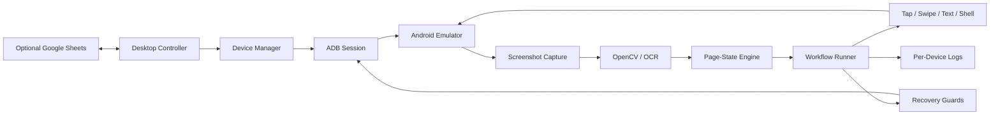

# DevicePilot

### Android Emulator Automation & Computer-Vision Controller

> Orchestrate Android devices through ADB, computer vision, OCR, state detection and a multi-device desktop control plane.

**Built by OneStop Infinite FZE LLC**  
`Python` · `ADB` · `BlueStacks` · `OpenCV` · `Tesseract OCR` · `Tkinter` · `Google Sheets`

---

## Overview

DevicePilot is a Python automation framework for **controlled Android-device and emulator testing**. It combines ADB device control, screenshot analysis, OCR, pixel/template-based page detection, task execution, device recovery logic and a desktop controller for coordinating multiple emulator instances.

The included project is designed around BlueStacks during development and testing, but the ADB interaction layer is structured around device identifiers and standard Android shell operations.

This repository intentionally uses a **generic target application profile**. Configure the package/activity for an Android application you are authorized to test through environment variables.

## Why it is interesting

DevicePilot goes beyond simple coordinate clicking. The automation engine continually reasons about observable device state:

```text
Android Emulator
      ↓
ADB Transport
      ↓
Screenshot Capture
      ↓
Computer Vision / OCR
      ↓
Page-State Detection
      ↓
Workflow Decision
      ↓
Tap / Swipe / Text / App Control
      ↓
Verification + Recovery
```

The controller adds a second orchestration layer for multi-device execution, task selection, saved state, status monitoring and per-device diagnostics.

## Core Capabilities

- **ADB lifecycle management** — connect, verify, reconnect and target individual Android instances.
- **BlueStacks discovery** — parse emulator configuration and map instances to ADB ports.
- **Computer vision** — OpenCV-based screenshot inspection and visual matching.
- **OCR** — Tesseract integration with optional EasyOCR support.
- **Page-state profiles** — region/pixel-grid descriptors stored in `pages.json`.
- **Input automation** — taps, swipes, text entry and Android shell commands.
- **App lifecycle control** — configurable package/activity launch, foreground checks and recovery.
- **Multi-device controller** — desktop UI for selecting devices and running tasks.
- **Worker isolation** — multiprocessing/threading paths for controlled concurrent execution.
- **Recovery logic** — detects dropped ADB sessions, offline emulators and unexpected states.
- **Per-device logging** — independent logs make parallel runs easier to inspect.
- **Status synchronization** — optional Google Sheets integration for external control/status data.
- **State persistence** — controller state, named presets, task sets and runtime status caches.
- **Visual diagnostics** — screenshot/page data and detailed execution traces for troubleshooting.

## Architecture



## Repository Layout

```text
.
├── device_controller.py          desktop orchestration UI
├── android_automation_engine.py  ADB, vision, state and workflow engine
├── pages.json                    visual page-state descriptors
├── requirements.txt              core Python dependencies
├── requirements-optional.txt     optional OCR / drag-drop enhancements
├── .env.example                  generic target configuration
└── docs/
    └── ARCHITECTURE.md
```

## Controller UI

The desktop controller is built with Tkinter and provides a control surface for:

- discovering configured emulator instances
- checking device connectivity
- selecting tasks per device
- running test or multi-device execution modes
- stopping work quickly
- saving and restoring UI state
- viewing task status and execution logs
- synchronizing external status data when configured

Optional `tkinterdnd2` support enables drag-and-drop functionality in supported controller tools; it is not a hard dependency.

## Visual State Detection

`pages.json` contains visual screen descriptors based on selected regions, average colors and sampled pixel grids. The automation engine uses these descriptors alongside OCR/template checks to decide what state the Android application is currently presenting.

This produces a more resilient workflow than blindly replaying fixed taps because actions can be gated on the page/state actually detected.

## Emulator Test Environment

Development and validation use **BlueStacks on Windows** as the emulator environment. DevicePilot discovers emulator instances, resolves ADB ports, validates device connectivity and can verify the live Android resolution/density before executing coordinate-sensitive automation.

The engine also distinguishes between an emulator process that is still alive and an ADB connection that has temporarily dropped, which allows recovery without immediately treating every transport interruption as a device crash.

## Configuration

Copy:

```text
.env.example
```

to:

```text
.env
```

Then configure a target application used in your own test environment:

```env
TARGET_APP_PACKAGE=com.example.targetapp
TARGET_APP_ACTIVITY=.MainActivity
TARGET_APP_PACKAGE_HINTS=targetapp
```

Optional external status/control configuration:

```env
CONTROL_SHEET_DOC=android_automation
GOOGLE_SERVICE_ACCOUNT_JSON=service-account.json
```

Never commit the real service-account JSON.

## Requirements

### Software

- Windows 10/11 recommended
- Python 3.11+
- Android Platform Tools / `adb` on PATH
- BlueStacks for the included emulator workflow
- Tesseract OCR for OCR-enabled paths

### Python

```bash
pip install -r requirements.txt
```

Optional:

```bash
pip install -r requirements-optional.txt
```

## Windows Setup

Run:

```text
setup_windows.bat
```

Then:

```text
run_controller.bat
```

Or manually:

```bash
python device_controller.py
```

## How the Engine Works

### 1. Device discovery
BlueStacks configuration is parsed to find emulator instances and their ADB endpoints.

### 2. Connectivity
ADB is connected and verified. The engine includes reconnect logic for transient transport loss.

### 3. Visual observation
Screenshots are captured and processed through OpenCV/OCR and page-profile comparisons.

### 4. State-aware workflow
Actions are selected based on the detected page/state rather than on timing alone.

### 5. Interaction
ADB performs taps, swipes, text entry, package checks and application lifecycle operations.

### 6. Recovery
Guard logic watches application/device state and attempts bounded recovery when sessions drop or the observed state becomes invalid.

### 7. Multi-device orchestration
The desktop controller can run work across multiple configured devices while maintaining per-device state and logs. Its task runner uses worker-level stop controls and connectivity verification before execution.

## Safety & Intended Use

DevicePilot is intended for **authorized testing, QA, repetitive-device workflows and emulator automation**. Only automate devices and applications you own or are permitted to test. Respect application terms, platform policies and applicable law.

The repository does not include production credentials, target-app secrets or APK files.

## Engineering Notes

The project includes several patterns that make it useful as an automation portfolio piece:

- thread-safe per-device screenshot locking
- independent device loggers
- ADB connection verification
- live display-size / density validation
- page configuration validation
- worker stop/pause separation
- persistent UI state
- multi-process execution entry points
- visual state profiles
- recovery guards for emulator/ADB instability

The source validates required page definitions at startup so missing visual-state configuration is surfaced explicitly rather than silently degrading the workflow.

## Limitations

- The supplied page profiles are calibrated for a particular test workflow and display geometry; new target applications require their own profiles.
- Coordinate-sensitive routines depend on the expected Android display dimensions and density.
- BlueStacks-specific discovery is Windows-oriented.
- OCR accuracy depends on the installed OCR engine, image quality and target UI.
- Google Sheets integration is optional and requires your own service-account configuration.

## Portfolio Skills Demonstrated

- Python automation architecture
- Android Debug Bridge (ADB)
- emulator orchestration
- computer vision
- OCR
- UI-state recognition
- concurrency and multiprocessing
- resilient recovery logic
- desktop controller development
- structured logging
- external API/data synchronization
- configuration-driven automation

---

**OneStop Infinite FZE LLC — AI & Automation Solutions**
